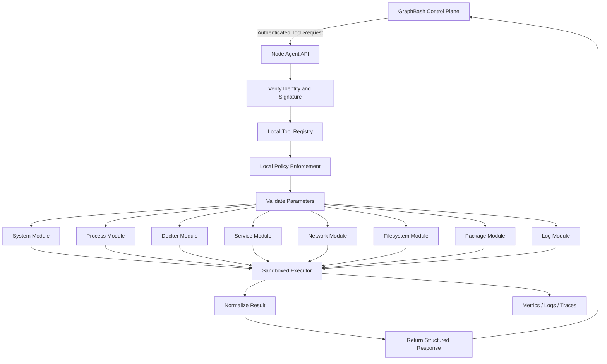

# GraphBash Linux Node Agent

> Lightweight and secure Linux execution service for the GraphBash platform.


## Overview

The GraphBash Linux Node Agent runs on a managed Ubuntu machine and exposes a controlled catalogue of system-administration tools to the GraphBash Control Plane.

The node agent does not provide unrestricted remote shell access. Each supported operation is implemented as a typed tool with validated parameters, defined permissions, a risk level, a timeout, an output limit, and an audit context.

The agent performs local policy checks before interacting with the operating system, Docker, systemd, networking tools, package management, or approved filesystem paths.

## Responsibilities

- Register the node with the control plane
- Maintain secure node identity
- Send regular heartbeat and health information
- Receive signed and authenticated tool requests
- Validate tool names and parameters
- Apply local security policy
- Execute approved Linux operations
- Enforce command allowlists and timeouts
- Restrict filesystem paths
- Limit output size
- Normalize tool results
- Return exit codes and structured errors
- Produce metrics, logs, and traces
- Operate as a hardened systemd service

## Architecture



## Technology Stack

### Backend

- Python 3.12+
- FastAPI
- Uvicorn
- Pydantic
- AsyncIO

### Linux Integration

- `/proc` and `/sys`
- psutil
- systemd and `systemctl`
- journald and `journalctl`
- Docker SDK for Python
- Linux networking utilities
- `apt` or approved package-manager APIs
- Restricted Python filesystem APIs

### Security

- Node identity certificate
- Mutual TLS or signed requests
- Tool allowlist
- Typed argument validation
- Restricted service, container, and path access
- Non-root execution where possible
- Execution timeout
- Output-size limit
- Secret redaction
- systemd hardening
- Local audit events

### Observability

- Prometheus client
- OpenTelemetry
- Structured JSON logs
- Node heartbeat metrics

### Testing and Delivery

- Pytest
- Ruff
- Black
- MyPy
- Bandit
- pip-audit
- Trivy
- Docker
- GitHub Actions

## Planned Tool Catalogue

### System Tools

```text
system.health
system.info
system.uptime
system.cpu
system.memory
system.disk
system.load
system.hostname
system.kernel
```

### Process Tools

```text
process.list
process.top_cpu
process.top_memory
process.inspect
process.kill
```

### Docker Tools

```text
docker.list
docker.inspect
docker.logs
docker.stats
docker.start
docker.stop
docker.restart
docker.remove
```

### Service Tools

```text
service.status
service.list
service.logs
service.start
service.stop
service.restart
```

### Network Tools

```text
network.interfaces
network.connections
network.ports
network.ping
network.dns_lookup
network.route
```

### Filesystem Tools

```text
file.list
file.read
file.search
file.size
file.copy
file.move
file.delete
```

### Package Tools

```text
package.list_installed
package.check_updates
package.install
package.remove
package.update
```

State-changing and destructive tools will not be enabled until the approval and policy systems are complete.

## Example Tool Contract

```json
{
  "name": "docker.restart",
  "description": "Restart an approved Docker container.",
  "risk_level": "medium",
  "requires_approval": true,
  "timeout_seconds": 60,
  "permissions": ["docker:restart"],
  "parameters": {
    "container_name": "string"
  }
}
```

## Planned Repository Structure

```text
GraphBash-node-agent/
├── app/
│   ├── api/
│   │   └── v1/
│   ├── core/
│   ├── modules/
│   │   ├── system/
│   │   ├── process/
│   │   ├── docker/
│   │   ├── service/
│   │   ├── network/
│   │   ├── filesystem/
│   │   ├── package/
│   │   └── logs/
│   ├── security/
│   ├── schemas/
│   ├── telemetry/
│   └── main.py
├── systemd/
│   └── GraphBash-agent.service
├── scripts/
├── tests/
│   ├── unit/
│   ├── integration/
│   └── security/
├── docs/
├── .github/workflows/
├── .env.example
├── Dockerfile
├── pyproject.toml
└── README.md
```

## Current Development Status

**Current phase: Repository initialization**

| Component | Status |
|---|---|
| Repository created | Completed |
| README and architecture | Completed |
| FastAPI service skeleton | Next |
| Agent configuration | Planned |
| Health endpoint | Planned |
| Node identity | Planned |
| Registration and heartbeat | Planned |
| Tool registry | Planned |
| System health tools | Planned |
| Process tools | Planned |
| Docker read-only tools | Planned |
| Service tools | Planned |
| Network tools | Planned |
| Filesystem restrictions | Planned |
| Local policy engine | Planned |
| systemd deployment | Planned |
| Telemetry and CI/CD | Planned |

## Roadmap

### Milestone 1 — Agent Foundation

- Create the Python package structure
- Add Pydantic configuration
- Add structured logging
- Implement `/health`, `/ready`, and `/version`
- Add typed response and error schemas
- Add Ruff, MyPy, Pytest, and pre-commit
- Add Dockerfile and GitHub Actions

### Milestone 2 — Node Identity and Connectivity

- Generate or provision node identity
- Implement secure registration
- Add heartbeat reporting
- Report agent version and host metadata
- Verify signed control-plane requests
- Add replay protection and request IDs
- Add graceful reconnect behavior

### Milestone 3 — Read-Only System Tools

- `system.health`
- `system.info`
- `system.uptime`
- `system.cpu`
- `system.memory`
- `system.disk`
- `system.load`
- Unit tests and normalized result schemas

### Milestone 4 — Additional Read-Only Tools

- Process listing and inspection
- Docker list, inspect, logs, and stats
- systemd service status and logs
- Network interface, connection, and port inspection
- Restricted file listing, reading, searching, and size inspection
- Package update checks

### Milestone 5 — Security Hardening

- Local tool allowlist
- Service and container allowlists
- Filesystem path restrictions
- Command argument validation
- Timeouts and process termination
- Output truncation
- Non-root service user
- systemd security directives
- Security and command-injection tests

### Milestone 6 — Controlled Write Operations

- Approval-token validation
- Docker start, stop, and restart
- Service start, stop, and restart
- Approved package operations
- Reversible file operations
- Detailed audit events
- Rollback strategy where possible

### Milestone 7 — Production Readiness

- Prometheus metrics
- OpenTelemetry traces
- Centralized logs
- Node diagnostic bundle
- Integration tests with the control plane
- Package or installation script
- systemd deployment documentation
- Release candidate

## Initial Development Target

The first working version should:

1. Start as a FastAPI service on Ubuntu.
2. Return `/health` and `/version`.
3. Register with the control plane.
4. Send heartbeat information.
5. Execute `system.health`.
6. Return CPU, memory, disk, load, and uptime in a structured response.
7. Log the request without exposing secrets.

## Local Development

Create the virtual environment:

```bash
python3 -m venv .venv
source .venv/bin/activate
```

Install dependencies:

```bash
pip install -e ".[dev]"
```

Run the agent:

```bash
uvicorn app.main:app --host 0.0.0.0 --port 9000 --reload
```

Run tests:

```bash
pytest
```

Run quality checks:

```bash
ruff check .
black --check .
mypy app
```

## Planned systemd Deployment

```ini
[Unit]
Description=GraphBash Linux Node Agent
After=network-online.target
Wants=network-online.target

[Service]
Type=simple
User=GraphBash
Group=GraphBash
WorkingDirectory=/opt/GraphBash-agent
EnvironmentFile=/etc/GraphBash-agent.env
ExecStart=/opt/GraphBash-agent/.venv/bin/uvicorn app.main:app --host 0.0.0.0 --port 9000
Restart=always
RestartSec=5
NoNewPrivileges=true
PrivateTmp=true
ProtectSystem=strict
ProtectHome=true

[Install]
WantedBy=multi-user.target
```

The final hardening configuration will be updated according to the permissions required by each enabled tool.

## Security Principles

- No unrestricted shell endpoint
- Reject unknown tools
- Reject unexpected parameters
- Use non-root execution wherever possible
- Restrict approved paths, services, containers, and packages
- Apply timeouts to every operation
- Limit and sanitize output
- Redact environment secrets
- Validate approval evidence for write operations
- Record a request ID for every execution
- Block critical operations by default

## Project Status Disclaimer

This agent is under development and must not be installed on production systems until authentication, transport security, local policy enforcement, security tests, and deployment hardening are complete.
